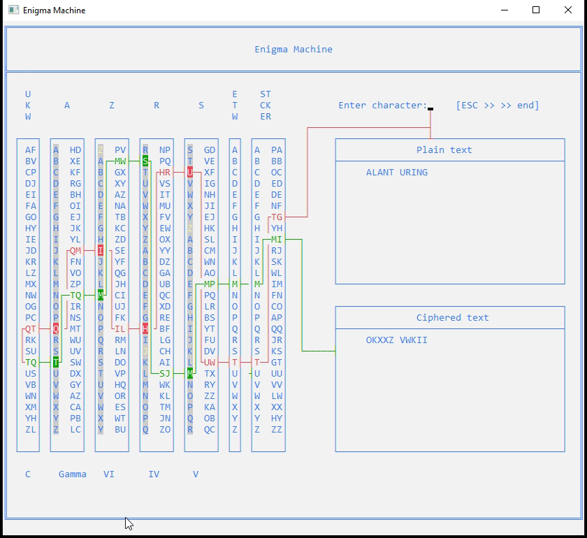

# ENIGMA MACHINE

Enigma Machine emulator writen in C.



## How to build

See Makefile for the build scripts.

To build the command line example, simply run make or make compile at the command line in the current directory.

By default, this will generate an executable called Enigma.exe is bound to in Makefile. To then run the program execute:

```
Enigma.exe
```

in the project directory.

## Ciphering text

To cipher some plain text, you will need to generate keys for the machine you want to use. There are 4 types of configurations:

- 3-rotor M3 Kriegsmarine UKW = B
- 3-rotor M3 Kriegsmarine UKW = C
- 4-rotor M4 Kriegsmarine UKW = B
- 4-rotor M4 Kriegsmarine UKW = C

To generate keys, select option 2 in the main menu and then select the desired machine configuration. Once you have done this, you can select option 1 in the main menu, select the machine you just generated the keys for and start typing your plain text.

---
⌨️ With ❤️ by [javiermunooz](https://github.com/javiermunooz) 
